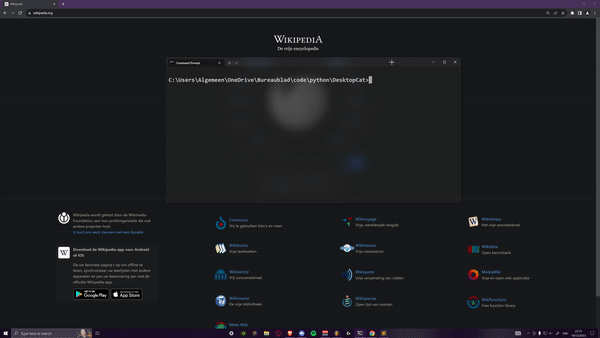

## Note: This project hasn't been finished (yet)...
# Desktop Cat

> This project is heavily inspired by [Desktop Goose](https://samperson.itch.io/desktop-goose)

Do you want a cat that keeps you company on your desktop? A cat that walks and plays around, and sometimes even steals your windows?
Well look no further, you found what you were looking for!


<!-- TODO: maybe some GIF here -->

## Installing Desktop Cat 
> Note: Desktop Cat is currently only available on `Windows`


## Release Build
If you don't have python, or don't want to install python, I have compiled the whole python project into a single executable.

**Note:** When trying to install the executable, your antivirus might block the download, probably because I used PyInstaller to compile the entire python source code into a single executable, and because the file is pretty big, so just beware of that.
If you don't trust it you can still download and run from [Source](#source-code).

Latest Release:
`Release/Desktop_Cat_build.exe`

**[Click](Release/)** to download latest Release

### Installing from source
If you want to download the source code and run it directly instead you can clone it with git like this:

```bat
git clone https://github.com/DeanCash/DesktopCat
```

Make sure you have the right python dependencies installed when trying to run from source

```bat
pip install -r requirements.txt
```

The entry point for running manually is `main.py` which you can run like this.

```bat
py main.py
```
